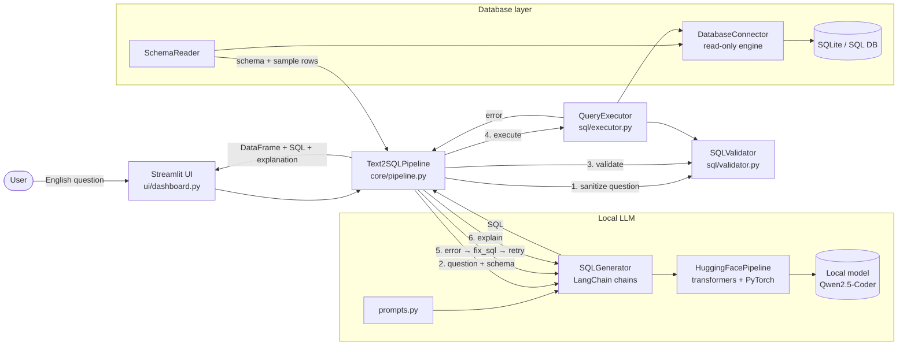

# 💬 English → SQL

[](https://github.com/Ajayvishal23/english-to-sql/actions/workflows/tests.yml)


**Talk to any SQL database in plain English — no SQL knowledge needed.**

Type a question, and the app writes the SQL, shows it to you, checks that it is safe,
runs it **read-only**, explains it in everyday words and fixes it automatically if it
fails. The AI model runs **on your own computer** (LangChain + Hugging Face
Transformers): it is downloaded once and then works offline. No API keys, no cloud,
your data never leaves your machine.

```
You:  Show all customers from Germany.
SQL:  SELECT first_name, last_name FROM customers WHERE country = 'Germany';
```

## 🚀 Get started in 2 minutes

You only need **Python 3.11 or newer** ([download](https://www.python.org/downloads/)).

```bash
git clone https://github.com/Ajayvishal23/english-to-sql.git
cd english-to-sql
```

| Windows | macOS / Linux |
|---|---|
| Double-click **`start.bat`** | Run **`./start.sh`** |

The first start installs everything, runs the tests, downloads the AI model (~1 GB) and
opens **http://localhost:8501** in your browser. Later starts take seconds.
A sample shop database is created automatically so you can try it right away.

**How to use it**

1. Pick an example or type a question, then click **✨ Generate SQL**.
2. Check the SQL (a green badge confirms it is a safe, read-only query) and click **▶ Run query**.
3. See the results as a table or chart, read the plain-English explanation, download CSV/JSON.

To use your own data, open **🗄️ Database** in the sidebar and upload a SQLite file,
enter its path, or paste a connection URL.

---

## Features

| Area | What you get |
|---|---|
| Database connection | SQLite file (sample, upload or path) and any SQLAlchemy URL (PostgreSQL, MySQL, …) |
| Schema discovery | Tables, views, columns, types, primary keys, foreign keys, row counts |
| English → SQL | LangChain chains over a local Hugging Face model (default `Qwen/Qwen2.5-Coder-0.5B-Instruct`) with schema + sample-row context |
| Review first | The generated SQL goes into an editor. Nothing runs until you click **Run** (optional auto-run) |
| Safety | Validator allows a single `SELECT`/`WITH … SELECT` only, blocks `DROP DELETE ALTER TRUNCATE UPDATE INSERT` and more |
| Read-only execution | SQLite is opened with `mode=ro` + `PRAGMA query_only` + an authorizer that denies all writes; every transaction is rolled back |
| Self-correction | On an error the model gets the error message and retries (configurable) |
| Explanation | Plain-English bullet points for any query |
| Results | Interactive table, row/time metrics, CSV and JSON download, row cap + timeout |
| Explorer | Column list, data preview, relationship graph |
| Charts | Automatic bar/line chart when the result has a label and a number column |
| History | The last 50 queries, one click to load back into the editor |

---

## Quick start

### 1. Install the prerequisite

* **Python 3.11+** — https://www.python.org/downloads/

That's all. No Ollama or other model server is needed.

### 2. Windows: one click (details)

Double-click **`start.bat`**. It will:

1. create a virtual environment and install the packages (PyTorch, Transformers, LangChain, Streamlit…),
2. run the test suite (steps 1–2 only on first run or when `requirements.txt` changes),
3. download the AI model (~1 GB, first run only) and answer one test question,
4. open the app at http://localhost:8501.

To stop the app, close the black window or double-click **`stop.bat`**.
Logs: `install_log.txt`, `model_check.txt`, `app_log.txt`.

### 3. Manual install (any OS)

```bash
cd english-to-sql
python -m venv .venv
source .venv/bin/activate          # Windows: .venv\Scripts\activate
pip install -r requirements.txt
python scripts/create_sample_db.py  # optional: the app creates it automatically
python scripts/download_model.py    # downloads the model + runs one real question
streamlit run app.py
```

Or run `./setup.sh` (macOS/Linux) / `setup.bat` (Windows) for the install steps.

### 4. Use it

The sample database connects automatically. Type a question (or click an example),
press **Generate SQL**, review the query, then **Run query**.
The model loads in the background when the app starts. Answer speed depends mostly on free RAM: with 3 GB or more free, answers take seconds; on a busy 8 GB laptop (browser and other apps open) they can take a minute because Windows swaps to disk.

### 5. Run the tests (no model download needed)

```bash
pytest -q
```

### Choosing a model

Pick a model in **Settings → Model (Hugging Face)**, or set `T2S_MODEL`.

| Model | Download | RAM needed | Notes |
|---|---|---|---|
| `Qwen/Qwen2.5-Coder-0.5B-Instruct` (default) | ~1 GB | ~2 GB | Fast on a laptop CPU; recommended for 8 GB PCs |
| `Qwen/Qwen2.5-Coder-1.5B-Instruct` | ~3 GB | ~6.5 GB free | More accurate; close browsers first on 8 GB PCs |
| Custom… | varies | varies | Any Hugging Face *text-generation* chat model id |

**Hardware tuning (done automatically).** On a CPU the model runs in float32 (half precision
is several times slower on most laptop CPUs) using all physical cores. A CUDA GPU with compute
capability 7.0+ is used in float16 automatically; older GPUs (e.g. GeForce MX110) are ignored.
Before loading, the app checks free RAM and explains what to do instead of crashing.
Only one model is kept in memory at a time.

Models are saved as plain files in the project's `models/` folder (one sub-folder per model).
With an NVIDIA GPU, install the CUDA build of PyTorch for much faster answers.

---

## Configuration

Everything can be changed in the sidebar. Defaults come from environment variables:

| Variable | Default | Meaning |
|---|---|---|
| `T2S_MODEL` | `Qwen/Qwen2.5-Coder-0.5B-Instruct` | Hugging Face model id |
| `T2S_MAX_NEW_TOKENS` | `256` | Maximum length of a model answer |
| `HF_HOME` | HF default | Where downloaded models are stored |
| `T2S_MAX_ROWS` | `1000` | Row cap for results |
| `T2S_QUERY_TIMEOUT` | `15` | Seconds before a SQLite query is stopped |
| `T2S_MAX_RETRIES` | `2` | Auto-fix attempts after a failure |
| `T2S_SAMPLE_ROWS` | `2` | Example rows per table included in the prompt |
| `T2S_LOG_LEVEL` | `INFO` | Logging level (logs go to `logs/text2sql.log`) |

---

## Project structure

```
text2sql/
├── app.py                    # Streamlit entry point
├── core/
│   └── pipeline.py           # Orchestration: generate → validate → run → fix
├── database/
│   ├── connector.py          # Read-only engines, SQLite authorizer, timeouts
│   └── schema_reader.py      # Tables/columns/FKs, previews, prompt context
├── llm/
│   ├── generator.py          # LangChain + Hugging Face model, SQL extraction, chains
│   └── prompts.py            # System, generation, correction, explanation prompts
├── sql/
│   ├── validator.py          # Tokenizer-based safety checks, input sanitising
│   └── executor.py           # Safe execution, row caps, error cleanup
├── ui/
│   ├── dashboard.py          # Sidebar, Ask / Explore / History tabs
│   ├── charts.py             # Automatic chart suggestion
│   └── styles.py             # CSS theme
├── utils/
│   ├── config.py             # Settings from env vars
│   └── logger.py             # Console + rotating file logs
├── scripts/
│   ├── create_sample_db.py   # Builds data/sample.db
│   └── download_model.py     # Downloads the model + real end-to-end check
├── tests/                    # pytest suite (fake LLM, no network)
├── data/                     # sample.db is created here on first run
├── .streamlit/config.toml    # Theme
├── requirements.txt
├── start.bat / stop.bat      # Windows: install + test + launch / stop
├── start.sh                  # macOS/Linux: install + launch
├── setup.sh / setup.bat
└── README.md
```

`core/pipeline.py` and `utils/config.py` were added to the requested layout so
the UI stays thin and every piece of logic can be tested without Streamlit.

---

## Architecture



Plain-text version:

```
 User ──► Streamlit UI ──► Text2SQLPipeline
                              │
      ┌───────────────────────┼─────────────────────────────┐
      ▼                       ▼                             ▼
 SchemaReader ──► prompt   SQLGenerator ─LangChain─► HF model SQLValidator
      │           context     ▲  (generate / fix / explain)   │ allow SELECT only
      ▼                       │                             ▼
 DatabaseConnector ◄──── QueryExecutor ◄── valid SQL ───────┘
  (mode=ro, query_only,       │ error? ──► fix_sql ──► retry (N times)
   authorizer, timeout)       ▼
                         pandas DataFrame ──► table / CSV / JSON
```

### Request flow

1. **Sanitise** – control characters removed, length capped, prompt delimiters neutralised.
2. **Generate** – the model gets a system prompt (rules), the schema as `CREATE TABLE`
   statements with a few sample rows, two worked examples and the question.
3. **Extract** – the first SQL statement is pulled out of the reply.
4. **Validate** – a quote- and comment-aware tokenizer checks: one statement,
   starts with `SELECT`/`WITH`, no forbidden keywords or functions. An unsafe query is
   sent back to the model once for a safe rewrite.
5. **Review** – the SQL is shown in an editable box.
6. **Execute** – re-validated, run in a transaction that is always rolled back,
   capped at *N* rows and stopped after the timeout.
7. **Self-correct** – on an error the model sees the failing SQL and the error and tries again.
8. **Explain & display** – plain-English explanation, results, downloads, history.

### Security model (defence in depth)

| Layer | Protects against |
|---|---|
| Input sanitising | Control characters, huge inputs, prompt-delimiter injection |
| Prompt rules | The model is told the question is data and must only produce SELECTs |
| `SQLValidator` | Writes/DDL, stacked statements (`; DROP …`), `ATTACH`, `PRAGMA`, `SELECT … INTO`, file-access functions, keywords hidden after comments |
| SQLite `mode=ro` | The file handle itself cannot write |
| `PRAGMA query_only` | SQLite refuses any change to the database |
| SQLite authorizer | Only read/select/function operations and a whitelist of introspection pragmas are allowed |
| Rollback + row cap + timeout | Nothing is committed; runaway queries are stopped |
| Server databases | Use a database user with **SELECT-only** grants; PostgreSQL sessions are also set to `READ ONLY` |

---

## Sample database

`data/sample.db` is a small retail dataset (rebuild any time with
`python scripts/create_sample_db.py --force`):

| Table | Rows | Notes |
|---|---|---|
| `customers` | 120 | 10 countries incl. Germany, India, USA |
| `employees` | 5 | `manager_id` self-reference |
| `categories` | 5 | |
| `products` | 26 | price, stock, discontinued flag |
| `orders` | 600 | 2023-01 → 2025-06, status, shipping country |
| `order_items` | ~1,500 | quantity, price, discount |
| `order_totals` | view | total value per order |

Questions to try:

* Show all customers from Germany.
* What are the top 5 best-selling products by revenue?
* How many orders were placed each month in 2024?
* Which employee handled the most orders?
* List customers who have never placed an order.
* What is the average order value per country?
* Which products are low on stock (fewer than 20 units)?

---

## Troubleshooting

| Problem | Fix |
|---|---|
| "Could not download or open model" | Check the model id and your internet connection (only needed for the first download). |
| First question is slow | The model is being downloaded/loaded. Use **Settings → Load model now** to do it up front. |
| Slow answers | Use the 0.5B model, lower *Max answer length*, set *Sample rows in prompt* to 0–2. |
| "Not enough free memory" | Close browsers/games, or switch to the 0.5B model. |
| "A required privilege is not held" | Fixed: models are stored as plain files in `models/` (no symlinks). |
| Wrong column names | Increase *Sample rows in prompt*; use a code-focused model; edit the SQL before running. |
| "not authorized" error | The query tried a non-read operation and SQLite blocked it. This is expected. |
| PostgreSQL/MySQL | `pip install "psycopg[binary]"` or `pymysql`, then use the *Connection URL* option. |

---

## Future scalability recommendations

1. **Large schemas (100+ tables)** – don't send the whole schema. Embed table/column
   descriptions (e.g. `HuggingFaceEmbeddings` + ChromaDB/FAISS) and retrieve only the
   relevant tables per question. Add a business glossary ("revenue = quantity × price × (1 − discount)").
2. **Better accuracy** – store question → SQL pairs that users mark as correct and use
   them as dynamic few-shot examples; try SQL-tuned models (`qwen2.5-coder`,
   `sqlcoder`, `duckdb-nsql`); run a cheap `EXPLAIN` dry-run before execution.
3. **Stronger SQL parsing** – swap the tokenizer for [`sqlglot`](https://github.com/tobymao/sqlglot)
   to parse the AST, transpile between dialects and enforce table/column allow-lists per user.
4. **More databases** – the connector already accepts SQLAlchemy URLs; add dialect-specific
   prompts, statement timeouts (`SET statement_timeout`) and read replicas. DuckDB is a great
   engine for querying CSV/Parquet files directly.
5. **LangGraph** – the generate → validate → execute → fix loop is already built from LangChain
   chains; moving it to LangGraph adds tracing (LangSmith), branching and tool use. Because
   `SQLGenerator` accepts any LangChain Runnable, switching to another backend
   (e.g. `ChatOpenAI`, `ChatAnthropic`, or `HuggingFaceEndpoint`) is a one-line change.
6. **Multi-user deployment** – put the pipeline behind a FastAPI service, add authentication
   (OIDC), per-user connection permissions, audit logs of every query, and rate limits.
   Serve models on a GPU host with vLLM or Text Generation Inference for higher throughput.
7. **Performance** – cache schema context and query results (keyed by SQL + DB version),
   stream LLM tokens to the UI, and run long queries in a background worker.
8. **Insight layer** – automatic chart suggestions (Altair/Plotly), natural-language answer
   summaries, follow-up questions with conversation memory, and saved dashboards.
9. **Quality & ops** – evaluation set (e.g. Spider/BIRD-style) in CI to catch prompt
   regressions, Docker image + `docker compose` with a model server, structured JSON logs and metrics.

---

## 🤝 Contributing

Issues and pull requests are welcome! Please run `pytest -q` before opening a PR
(the tests use a fake model, so no download is needed).

## License

[MIT](LICENSE) © Ajay Vishal M V
